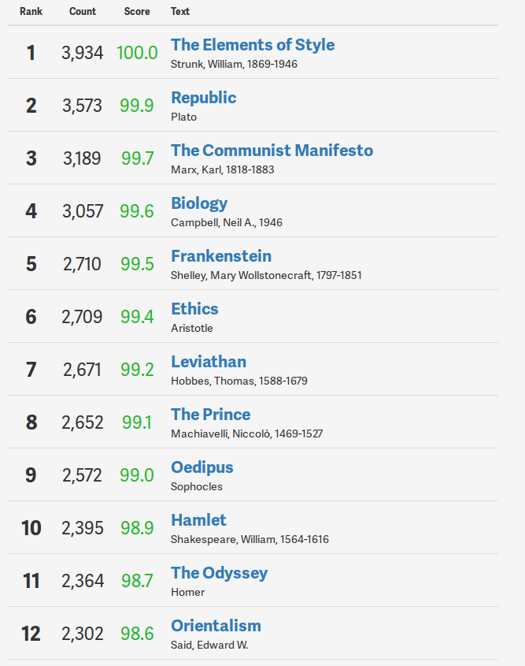
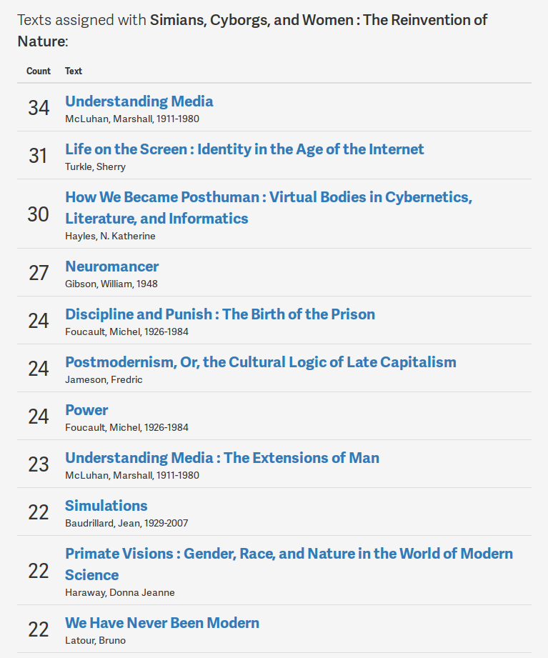

Great work and congratulations to everyone involved with the Open Syllabus Project.

I have to dig through the database for a while; all I can say for now is that I'm happy it's there to dig through.

* [NYTIMES on the Open Syllabus Project](http://www.nytimes.com/2016/01/24/opinion/sunday/what-a-million-syllabuses-can-teach-us.html) (partners)

* Dive right in to the [syllabus explorer](http://explorer.opensyllabusproject.org/) (beta)

I would've expected Toni Morrison's _Beloved_ to be pretty high up. I'm pleased to see Marx at three, and Adam Smith not in the top 12 pictured here. Rouseau should be here.

Very pleased to see Edward Said's seminal work _Orientalism_.

But I'm very surprised by Strunk's _Element's of Style_. It's not only inconsistent with it's own suggestions, but it also contradicts some of its strongest, let's call them rules, as the text progresses. That's all to say, there's a lot to learn from this project.

I was curious whether Virginia Woolf's _Orlando_ showed up....anywhere, really.

Searching the Explorer for _Orlando_ yielded no results.

I figured surely it's read in dialog with Woolf's other 1928 work, _A Room of One's Own_.

[The results were really surprising](http://explorer.opensyllabusproject.org/text/783488).

However, [results for Joyce's night book are as you'd expect](http://explorer.opensyllabusproject.org/text/440655), I think.

I understand what's going on, but it took me off guard.

Here's one I can't explain: compare results for two seminal works on contemporary tech culture: Rebel Code and Cathedral and the Bazaar. Both are taught, but they don't ever seem to be in the same frame:

* [Rebel Code](http://explorer.opensyllabusproject.org/text/10578235)

* [Cathedral and the Bazaar](http://explorer.opensyllabusproject.org/text/10180933)

Strange results when taken together.

The open syllabus project provides many opportunities for disciplinary studies research. Over all, there are few surprises. The canon has a ways to go.
